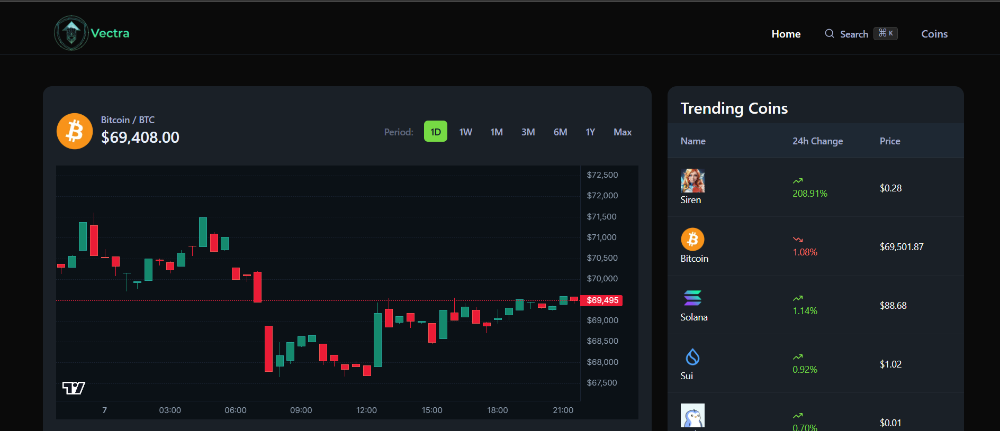

# Vectra Crypto Dashboard

Vectra is a modern, fast, and interactive cryptocurrency dashboard built with **Next.js** and **React**. It allows users to explore real-time crypto data, search for coins, view trending tokens, and track price changes with an intuitive interface. This project leverages the **CoinGecko API** to provide up-to-date market information and demonstrates best practices for React, TypeScript, SWR, and component-driven UI design.

---

## Table of Contents

- [Features](#features)
- [Demo](#demo)
- [Tech Stack](#tech-stack)
- [Installation](#installation)
- [Usage](#usage)
- [Project Structure](#project-structure)
- [API Integration](#api-integration)
- [Contributing](#contributing)
- [License](#license)

---

## Features

- **Global Coin Search** – Quickly search for coins by name or symbol with a responsive command palette.
- **Trending Coins** – Display top trending cryptocurrencies in real-time.
- **Price Tracking** – View 24-hour price changes with clear visual indicators (up/down trends).
- **Debounced & Optimized API Calls** – Prevents excessive requests while typing, using `react-use` and SWR.
- **Keyboard Shortcuts** – Open search modal with `Ctrl+K` (Windows/Linux) or `⌘+K` (Mac).
- **Responsive Design** – Works seamlessly on desktop and mobile.
- **Accessible Navigation** – Semantic HTML, `aria-current` for active links, and keyboard navigation.

---

## Demo


*Screenshot of the search modal and trending coins.*

Live demo : [https://vectra-nehmiya.vercel.app]

---

## Tech Stack

- **Framework**: Next.js 13 (App Router)
- **Frontend**: React 18 + TypeScript
- **State & Data Fetching**: SWR, React Hooks
- **API**: CoinGecko API
- **Styling**: Tailwind CSS
- **Icons**: Lucide-react
- **Utilities**: react-use (debounce, hotkeys)

---

## Installation

1. Clone the repo:
```bash
git clone https://github.com/nehmiya/vectra.git
cd vectra
```

2. Install dependencies:
```bash
npm install
# or
yarn install
```

3. Add environment variables in `.env.local`:
```env
COINGECKO_BASE_URL=https://api.coingecko.com/api/v3
COINGECKO_API_KEY=your_api_key_here

NEXT_PUBLIC_COINGECKO_API_KEY = your_api_key_here

NEXT_PUBLIC_COINGECKO_WEBSOCKET_URL = wss://stream.coingecko.com/v1
```

4. Run the development server:
```bash
npm run dev
# or
yarn dev
```

5. Open [http://localhost:3000](http://localhost:3000) in your browser.

---

## Usage

- **Search Coins**: Click the search button or press `Ctrl+K` / `⌘+K` to open the modal. Type a coin name or symbol to see results with 24h price change.
- **Trending Coins**: When no search query is active, trending coins are displayed automatically.
- **Navigation**: Use the header links to navigate Home or Coins pages. Active page is highlighted.

---

## Project Structure

```
Vectra
├─ app
│  ├─ coins
│  │  └─ [id]                 # Dynamic coin pages
├─ components
│  ├─ Home                     # Home-specific components
│  ├─ ui                       # Shared UI components (buttons, inputs, modals, etc.)
│  ├─ Header.tsx
│  └─ SearchModal.tsx
├─ hooks                        # Custom React hooks
├─ lib                          # Utilities and API logic
│  ├─ coingecko.actions.ts
│  └─ utils.ts
├─ public
│  └─ assets                    # Logo, images, icons
├─ .gitignore
├─ next.config.js
├─ package.json
└─ tsconfig.json
```

---

## API Integration

- **Search Coins**: `/search?query={query}`
- **Market Data**: `/coins/markets?vs_currency=usd&ids={ids}&price_change_percentage=24h`

The project uses a **fetcher utility** to handle all requests, automatically including the API key and base URL. Debounced search ensures smooth typing without hitting rate limits.

---

## Contributing

Contributions are welcome!

1. Fork the repository
2. Create your feature branch (`git checkout -b feature/my-feature`)
3. Commit your changes (`git commit -m "Add my feature"`)
4. Push to the branch (`git push origin feature/my-feature`)
5. Open a pull request


---

Made with ❤️ using **Next.js**, **React**,